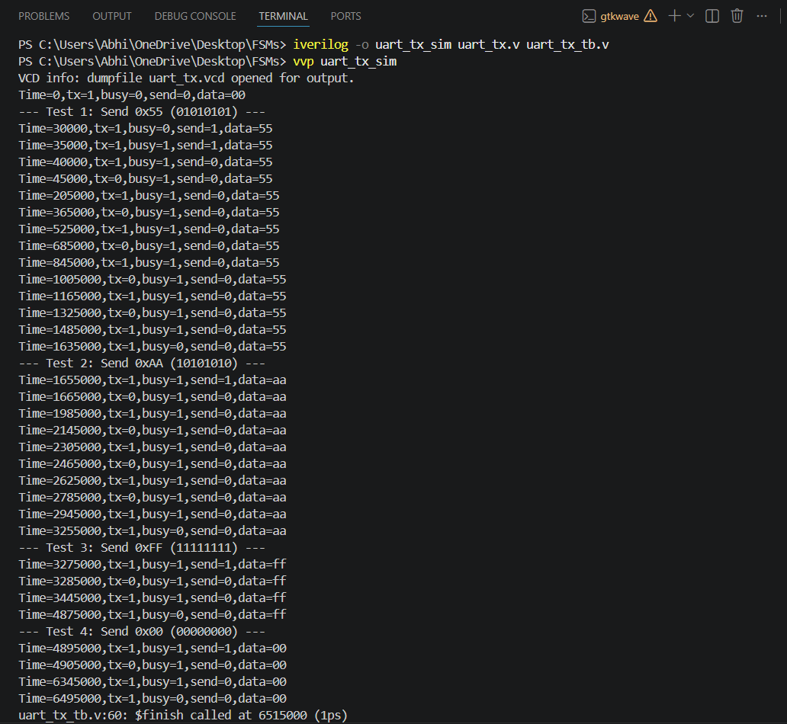
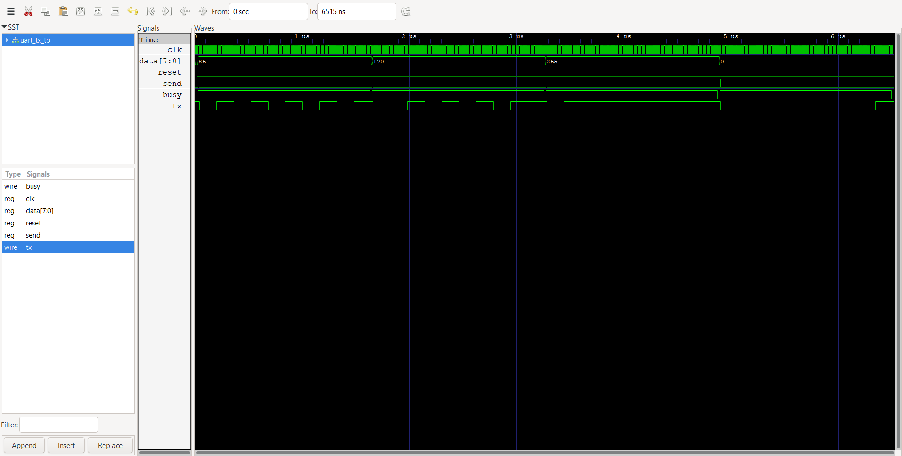
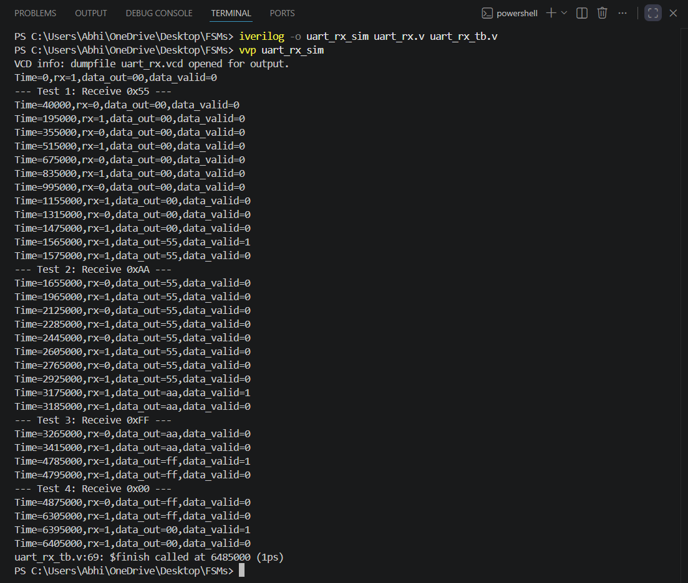
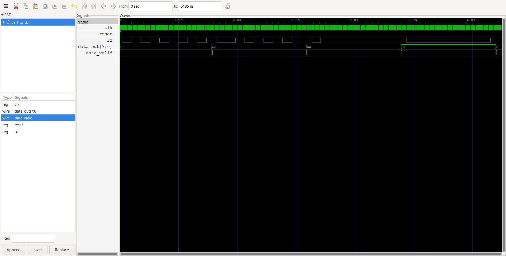
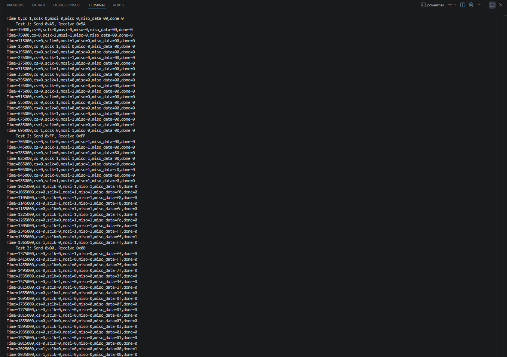
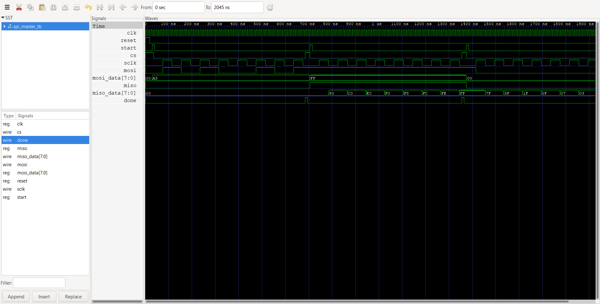
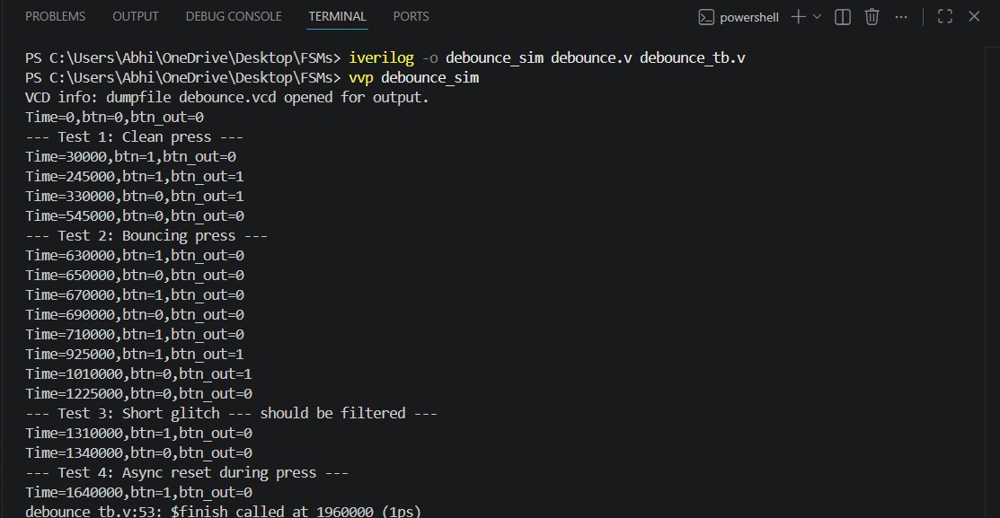
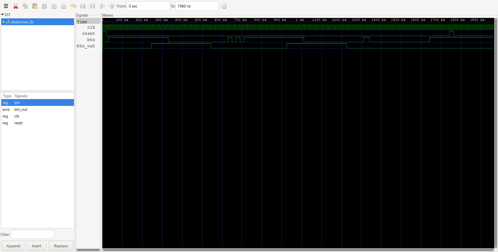

# 04 — Finite State Machines in Verilog

**Step 4 of 8** toward building a 16-bit pipelined RISC processor from scratch in Verilog.

This module covers Finite State Machine design in both Moore and Mealy styles, applied to practical digital circuits. All designs are implemented in Verilog, simulated with Icarus Verilog, and visualized using GTKWave.

---

## Project Structure

```
04-finite-state-machines/
├── src/                        # RTL design files
│   ├── moore_fsm.v             # Moore FSM — 101 sequence detector
│   ├── mealy_fsm.v             # Mealy FSM — 101 sequence detector
│   ├── seq_detector_1011.v     # Mealy FSM — 1011 sequence detector
│   ├── traffic_light.v         # Moore FSM — traffic light controller
│   ├── uart_tx.v               # FSM — UART transmitter
│   ├── uart_rx.v               # FSM — UART receiver
│   ├── spi_master.v            # FSM — SPI master controller
│   └── debounce.v              # FSM — switch debounce circuit
│
├── tb/                         # Testbenches
│   ├── moore_fsm_tb.v
│   ├── mealy_fsm_tb.v
│   ├── seq_detector_1011_tb.v
│   ├── traffic_light_tb.v
│   ├── uart_tx_tb.v
│   ├── uart_rx_tb.v
│   ├── spi_master_tb.v
│   └── debounce_tb.v
│
└── sim/                        # Simulation outputs
    ├── moore_fsm_terminal.png
    ├── moore_fsm_waveform.png
    ├── mealy_fsm_terminal.png
    ├── mealy_fsm_waveform.png
    ├── seq_detector_1011_terminal.png
    ├── seq_detector_1011_waveform.png
    ├── traffic_light_terminal.png
    ├── traffic_light_waveform.png
    ├── uart_tx_terminal.png
    ├── uart_tx_waveform.png
    ├── uart_rx_terminal.png
    ├── uart_rx_waveform.png
    ├── spi_master_terminal.png
    ├── spi_master_waveform.png
    ├── debounce_terminal.png
    └── debounce_waveform.png
```

---

## Modules Implemented

### 1. Moore FSM — 101 Sequence Detector (`moore_fsm.v`)

A Moore-style FSM that detects the bit sequence `101` on a serial input line. The output depends only on the current state (not the input), so it asserts `out = 1` one clock cycle after the final `1` is received.

- **States:** S0 → S1 → S2 → S3 (4 states, 2-bit encoding)
- **Output:** Registered; asserts high when state S3 is reached
- **Reset:** Asynchronous, active-high

| State | Meaning              | Input=0 → | Input=1 → |
|-------|----------------------|-----------|-----------|
| S0    | Initial / reset      | S0        | S1        |
| S1    | Received `1`         | S2        | S1        |
| S2    | Received `10`        | S0        | S3        |
| S3    | Received `101` ✓     | S2        | S1        |

---

### 2. Mealy FSM — 101 Sequence Detector (`mealy_fsm.v`)

A Mealy-style FSM that detects the bit sequence `101`. The output is combinationally dependent on both the current state and the current input, so detection is one clock cycle earlier than the Moore equivalent.

- **States:** S0, S1, S2 (3 states, 2-bit encoding)
- **Output:** Combinational; asserts high immediately when the final `1` of `101` is seen
- **Reset:** Asynchronous, active-high

| State | Meaning          | Input=0 → | Input=1 → | Out (on input) |
|-------|------------------|-----------|-----------|----------------|
| S0    | Initial / reset  | S0        | S1        | 0              |
| S1    | Received `1`     | S2        | S1        | 0              |
| S2    | Received `10`    | S0        | S0        | 1 (when in=1)  |

---

### 3. Mealy FSM — 1011 Sequence Detector (`seq_detector_1011.v`)

A Mealy FSM that detects the bit pattern `1011` on a serial input. Output is asserted immediately on the final `1`, with overlapping detection support.

- **States:** S0, S1, S2, S3 (4 states, 2-bit encoding)
- **Output:** Combinational; asserts when final `1` arrives at state S3
- **Reset:** Asynchronous, active-high

| State | Meaning           | Input=0 → | Input=1 → | Out (on input) |
|-------|-------------------|-----------|-----------|----------------|
| S0    | Initial / reset   | S0        | S1        | 0              |
| S1    | Received `1`      | S2        | S1        | 0              |
| S2    | Received `10`     | S0        | S3        | 0              |
| S3    | Received `101`    | S2        | S1        | 1 (when in=1)  |

---

### 4. Traffic Light Controller (`traffic_light.v`)

A Moore FSM that models a 3-phase traffic light system cycling through RED → GREEN → YELLOW → RED. A built-in 3-bit counter controls the hold duration for each phase.

- **States:** RED (2'b00), GREEN (2'b01), YELLOW (2'b10)
- **Timing:** RED holds for 4 cycles, GREEN holds for 4 cycles, YELLOW holds for 2 cycles
- **Outputs:** `red`, `green`, `yellow` (one-hot)
- **Reset:** Asynchronous, active-high; resets to RED with counter = 3

| Current State | Next State |
|---------------|------------|
| RED           | GREEN      |
| GREEN         | YELLOW     |
| YELLOW        | RED        |

---

### 5. UART Transmitter (`uart_tx.v`)

A Moore FSM-based serial transmitter implementing the 8N1 UART protocol. Transmits one byte serially with a start bit, 8 data bits (LSB first), and a stop bit.

- **States:** IDLE, START, DATA, STOP
- **Parameters:** CLKS_PER_BIT = 16 (simulation), configurable for real baud rates
- **Outputs:** `tx` (serial line), `busy` (high during transmission)
- **Reset:** Asynchronous, active-high

| State | tx value | Duration         |
|-------|----------|------------------|
| IDLE  | 1        | Until send pulse |
| START | 0        | 1 baud period    |
| DATA  | data bit | 8 baud periods   |
| STOP  | 1        | 1 baud period    |

---

### 6. UART Receiver (`uart_rx.v`)

A Moore FSM-based serial receiver. Detects the start bit, samples each data bit at the midpoint of each baud period, and asserts `data_valid` for one clock cycle when a full byte has been received.

- **States:** IDLE, START, DATA, STOP
- **Parameters:** CLKS_PER_BIT = 16, HALF_BIT = 8 (mid-point sampling)
- **Outputs:** `data_out` (received byte), `data_valid` (pulses high when byte ready)
- **Reset:** Asynchronous, active-high

| State | Action                                                   |
|-------|----------------------------------------------------------|
| IDLE  | Wait for rx to go low (start bit detected)               |
| START | Sample at midpoint to confirm valid start bit            |
| DATA  | Sample 8 data bits at midpoint of each baud period       |
| STOP  | Confirm stop bit, assert data_valid                      |

---

### 7. SPI Master (`spi_master.v`)

A Moore FSM-based SPI master controller. Transfers 8 bits full-duplex over MOSI/MISO with chip select control and configurable clock divider.

- **States:** IDLE, TRANSFER, FINISH
- **Parameters:** CLKS_PER_HALF = 4 (SPI clock divider)
- **Outputs:** `mosi`, `sclk`, `cs`, `miso_data`, `done`
- **Protocol:** CPOL=0, CPHA=0 — data sampled on rising edge, shifted on falling edge
- **Reset:** Asynchronous, active-high

| State    | Action                                                          |
|----------|-----------------------------------------------------------------|
| IDLE     | cs=1, wait for start pulse, latch mosi_data                     |
| TRANSFER | cs=0, generate sclk, shift out MOSI, sample MISO               |
| FINISH   | cs=1, assert done for one cycle, return to IDLE                 |

---

### 8. Debounce Circuit (`debounce.v`)

A counter-based debounce circuit with a 2-stage synchronizer. Filters mechanical switch bounce by requiring the input to remain stable for a fixed number of clock cycles before propagating the output change.

- **Parameters:** DEBOUNCE_LIMIT = 20 (cycles required for stable output)
- **Outputs:** `btn_out` (clean, debounced button signal)
- **Features:** 2-stage synchronizer (btn_sync0, btn_sync1) prevents metastability
- **Reset:** Asynchronous, active-high

| Behaviour                              | Result                                      |
|----------------------------------------|---------------------------------------------|
| Clean stable press                     | btn_out follows btn after debounce delay    |
| Rapid bouncing                         | btn_out suppressed until signal stabilises  |
| Short glitch < DEBOUNCE_LIMIT cycles   | Completely filtered                         |
| Async reset during press               | btn_out immediately clears to 0             |

---

## Simulation

Each module is simulated with Icarus Verilog and the waveform is viewed in GTKWave. Results are stored in the `sim/` directory.

### How to Simulate

```bash
iverilog -o moore_fsm_sim moore_fsm.v moore_fsm_tb.v
vvp moore_fsm_sim

iverilog -o mealy_fsm_sim mealy_fsm.v mealy_fsm_tb.v
vvp mealy_fsm_sim

iverilog -o seq_detector_1011_sim seq_detector_1011.v seq_detector_1011_tb.v
vvp seq_detector_1011_sim

iverilog -o traffic_light_sim traffic_light.v traffic_light_tb.v
vvp traffic_light_sim

iverilog -o uart_tx_sim uart_tx.v uart_tx_tb.v
vvp uart_tx_sim

iverilog -o uart_rx_sim uart_rx.v uart_rx_tb.v
vvp uart_rx_sim

iverilog -o spi_master_sim spi_master.v spi_master_tb.v
vvp spi_master_sim

iverilog -o debounce_sim debounce.v debounce_tb.v
vvp debounce_sim

gtkwave module.vcd
```

### Simulation Results

| Module                    | Terminal Output                         | Waveform                                |
|---------------------------|-----------------------------------------|-----------------------------------------|
| Moore FSM (101)           |          |          |
| Mealy FSM (101)           |          |          |
| Sequence Detector (1011)  |  |  |
| Traffic Light Controller  |      |      |
| UART Transmitter          |            |            |
| UART Receiver             |            |            |
| SPI Master                |         |         |
| Debounce Circuit          |           |           |

---

## Key Concepts

**Moore FSM** — outputs depend only on the current state. Simpler, but output lags by one clock cycle compared to Mealy.

**Mealy FSM** — outputs depend on both the current state and current inputs. Faster response, fewer states needed, but output can glitch with combinational logic.

**Sequence Detector** — an FSM that scans a bitstream and asserts an output whenever a specific pattern is recognized. Both overlapping and non-overlapping variants can be designed by choosing how the FSM re-enters its state chain after a match.

**Traffic Light Controller** — a real-world Moore FSM application using an internal counter to hold each phase for a set number of clock cycles before transitioning.

**UART Protocol** — asynchronous serial communication. No shared clock between TX and RX. Data framed as: idle(1) → start(0) → 8 data bits LSB first → stop(1). Baud rate must match on both ends.

**SPI Protocol** — synchronous serial communication with a shared clock (SCLK), chip select (CS), master-out-slave-in (MOSI), and master-in-slave-out (MISO). Full-duplex, faster than UART.

**Debounce Circuit** — mechanical switches produce multiple transitions (bounces) when pressed. A counter-based debounce requires the input to be stable for N consecutive clock cycles before the output changes, filtering all glitches shorter than N cycles.

---

## Tools Used

| Tool            | Purpose                        |
|-----------------|--------------------------------|
| Icarus Verilog  | RTL simulation and compilation |
| GTKWave         | Waveform visualization         |
| Verilog HDL     | Hardware description language  |

---

## 8-Step RISC Processor Roadmap

This repository is **Step 4** in an 8-part series building toward a 16-bit pipelined RISC processor:

| Step | Topic                                        | Status      |
|------|----------------------------------------------|-------------|
| 01   | Logic Gates & Boolean Algebra                | ✅ Complete |
| 02   | Combinational Circuits                       | ✅ Complete |
| 03   | Sequential Circuits                          | ✅ Complete |
| 04   | Finite State Machines                        | ✅ Complete |
| 05   | ALU — SystemVerilog + Assertions + Synthesis | ⏳ Upcoming |
| 06   | Processor Components                         | ⏳ Upcoming |
| 07   | 16-bit Pipelined RISC Processor              | ⏳ Upcoming |
| 08   | Protocols and Interfaces                     | ⏳ Upcoming |

---

## Author

**B. Abhi Chandra** — [@abhichandra586](https://github.com/abhichandra586)
