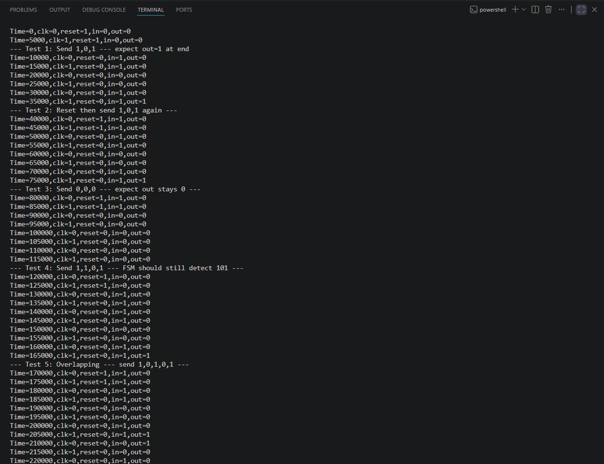
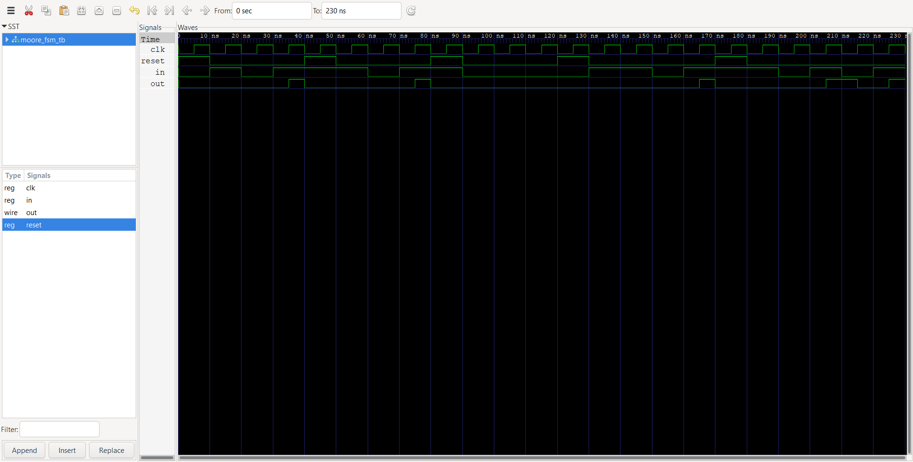
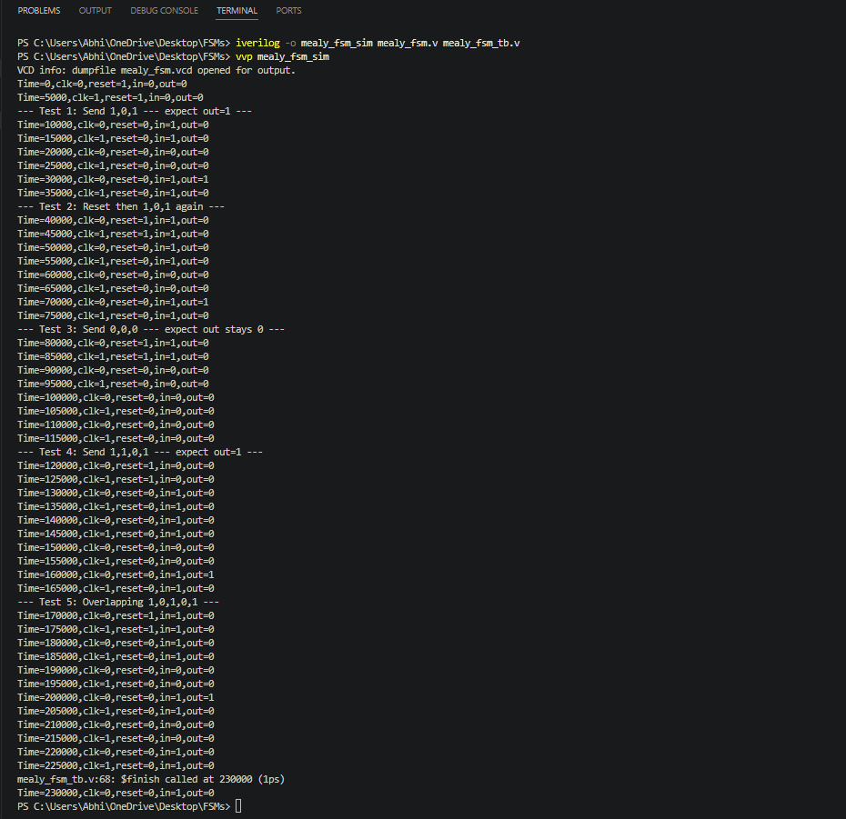
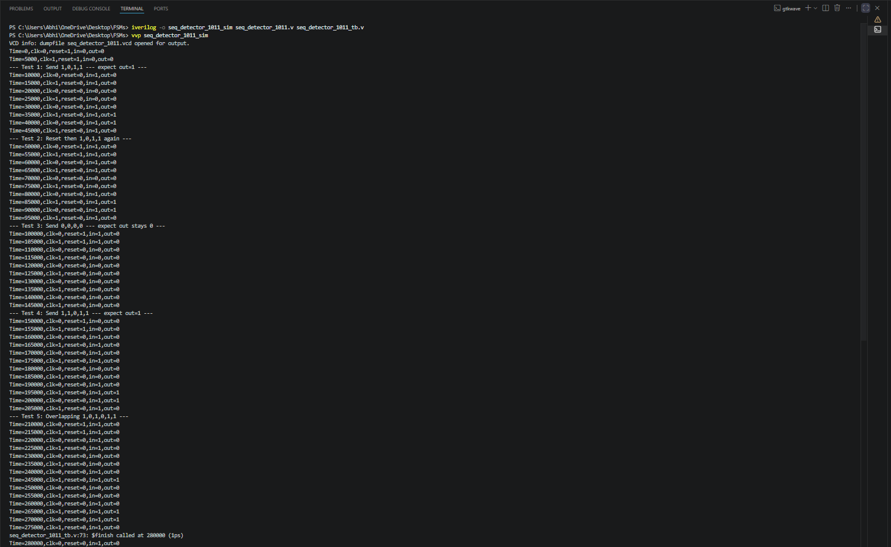
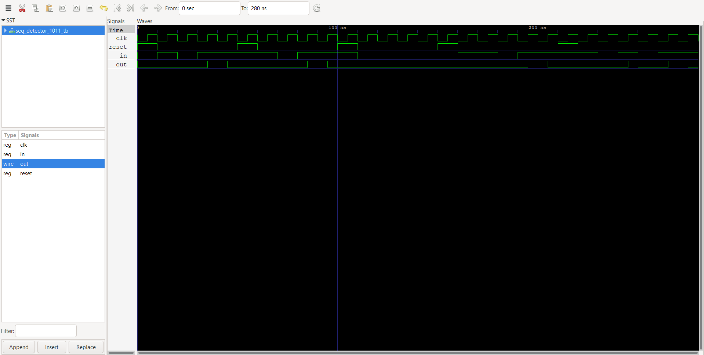
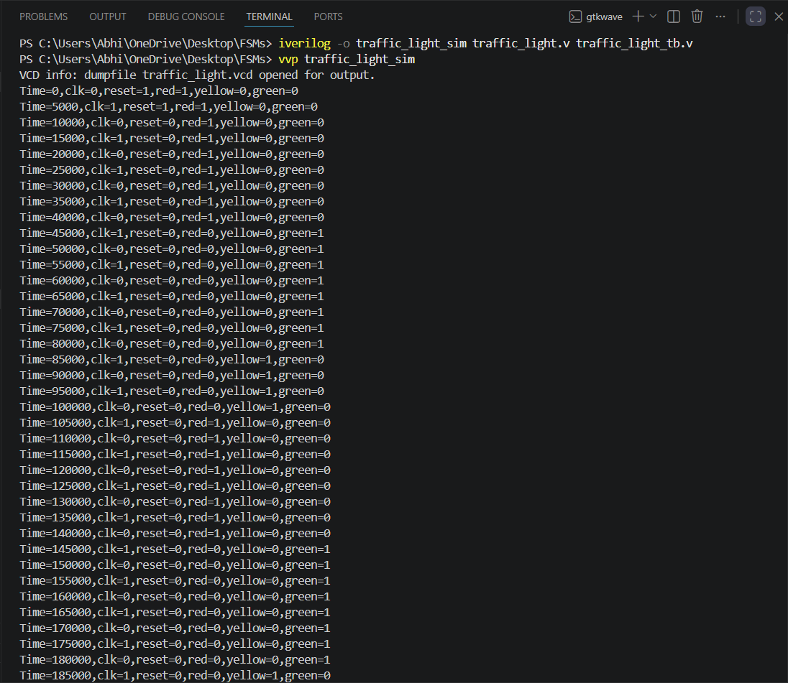
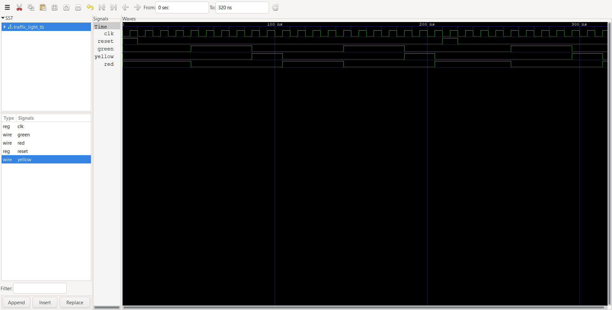

# 04 — Finite State Machines in Verilog

**Step 4 of 8** toward building a 16-bit pipelined RISC processor from scratch in Verilog.

This module covers Finite State Machine design in both Moore and Mealy styles, applied to practical digital circuits. All designs are implemented in Verilog, simulated with Icarus Verilog, and visualized using GTKWave.

---

## Project Structure

```
04-finite-state-machines/
├── src/                        # RTL design files
│   ├── moore_fsm.v             # Moore FSM — 101 sequence detector
│   ├── mealy_fsm.v             # Mealy FSM — 101 sequence detector
│   ├── seq_detector_1011.v     # Mealy FSM — 1011 sequence detector
│   └── traffic_light.v         # Moore FSM — traffic light controller
│
├── tb/                         # Testbenches
│   ├── moore_fsm_tb.v
│   ├── mealy_fsm_tb.v
│   ├── seq_detector_1011_tb.v
│   └── traffic_light_tb.v
│
└── sim/                        # Simulation outputs
    ├── moore_fsm_terminal.png
    ├── moore_fsm_waveform.png
    ├── mealy_fsm_terminal.png
    ├── mealy_fsm_waveform.png
    ├── seq_detector_1011_terminal.png
    ├── seq_detector_1011_waveform.png
    ├── traffic_light_terminal.png
    └── traffic_light_waveform.png
```

---

## Modules Implemented

### 1. Moore FSM — 101 Sequence Detector (`moore_fsm.v`)

A Moore-style FSM that detects the bit sequence `101` on a serial input line. The output depends only on the current state (not the input), so it asserts `out = 1` one clock cycle after the final `1` is received.

- **States:** S0 → S1 → S2 → S3 (4 states, 2-bit encoding)
- **Output:** Registered; asserts high when state S3 is reached
- **Reset:** Synchronous-on-posedge, active-high

| State | Meaning              | Input=0 → | Input=1 → |
|-------|----------------------|-----------|-----------|
| S0    | Initial / reset      | S0        | S1        |
| S1    | Received `1`         | S2        | S1        |
| S2    | Received `10`        | S0        | S3        |
| S3    | Received `101` ✓     | S2        | S1        |

---

### 2. Mealy FSM — 101 Sequence Detector (`mealy_fsm.v`)

A Mealy-style FSM that detects the bit sequence `101`. The output is combinationally dependent on both the current state and the current input, so detection is one clock cycle earlier than the Moore equivalent.

- **States:** S0, S1, S2 (3 states, 2-bit encoding)
- **Output:** Combinational; asserts high immediately when the final `1` of `101` is seen
- **Reset:** Synchronous-on-posedge, active-high

| State | Meaning          | Input=0 → | Input=1 → | Out (on input) |
|-------|------------------|-----------|-----------|----------------|
| S0    | Initial / reset  | S0        | S1        | 0              |
| S1    | Received `1`     | S2        | S1        | 0              |
| S2    | Received `10`    | S0        | S0        | 1 (when in=1)  |

---

### 3. Mealy FSM — 1011 Sequence Detector (`seq_detector_1011.v`)

A Mealy FSM that detects the bit pattern `1011` on a serial input. Output is asserted immediately on the final `1`, with overlapping detection support.

- **States:** S0, S1, S2, S3 (4 states, 2-bit encoding)
- **Output:** Combinational; asserts when final `1` arrives at state S3
- **Reset:** Synchronous-on-posedge, active-high
- **Timescale:** `1ns / 1ps`

| State | Meaning           | Input=0 → | Input=1 → | Out (on input) |
|-------|-------------------|-----------|-----------|----------------|
| S0    | Initial / reset   | S0        | S1        | 0              |
| S1    | Received `1`      | S2        | S1        | 0              |
| S2    | Received `10`     | S0        | S3        | 0              |
| S3    | Received `101`    | S2        | S1        | 1 (when in=1)  |

---

### 4. Traffic Light Controller (`traffic_light.v`)

A Moore FSM that models a 3-phase traffic light system cycling through RED → GREEN → YELLOW → RED. A built-in 3-bit counter controls the hold duration for each phase.

- **States:** RED (2'b00), GREEN (2'b01), YELLOW (2'b10)
- **Timing:** RED holds for 4 cycles, GREEN holds for 4 cycles, YELLOW holds for 2 cycles
- **Outputs:** `red`, `green`, `yellow` (one-hot)
- **Reset:** Synchronous-on-posedge, active-high; resets to RED with counter = 3

| Current State | Next State |
|---------------|------------|
| RED           | GREEN      |
| GREEN         | YELLOW     |
| YELLOW        | RED        |

---

## Simulation

Each module is simulated with Icarus Verilog and the waveform is viewed in GTKWave. Results (terminal output + waveform screenshots) are stored in the `sim/` directory.

### How to Simulate

```bash
# Example for the 1011 sequence detector
iverilog -o sim/seq_detector_1011.out src/seq_detector_1011.v tb/seq_detector_1011_tb.v
vvp sim/seq_detector_1011.out
gtkwave sim/seq_detector_1011.vcd
```

Repeat the same pattern for any other module by substituting the module name.

### Simulation Results

| Module                    | Terminal Output                          | Waveform                                  |
|---------------------------|------------------------------------------|-------------------------------------------|
| Moore FSM (101)           |           |            |
| Mealy FSM (101)           |           |            |
| Sequence Detector (1011)  |   |    |
| Traffic Light Controller  |       |        |

---

## Key Concepts

**Moore FSM** — outputs depend only on the current state. Simpler, but output lags by one clock cycle compared to Mealy.

**Mealy FSM** — outputs depend on both the current state and current inputs. Faster response, fewer states needed, but output can glitch with combinational logic.

**Sequence Detector** — an FSM that scans a bitstream and asserts an output whenever a specific pattern is recognized. Both overlapping and non-overlapping variants can be designed by choosing how the FSM re-enters its state chain after a match.

**Traffic Light Controller** — a real-world Moore FSM application using an internal counter to hold each phase for a set number of clock cycles before transitioning.

---

## Tools Used

| Tool            | Purpose                              |
|-----------------|--------------------------------------|
| Icarus Verilog  | RTL simulation and compilation       |
| GTKWave         | Waveform visualization               |
| Verilog HDL     | Hardware description language        |

---

## Roadmap / Future Plans

The following modules are planned to complete this step of the processor build:

- [ ] **UART Transmitter** — FSM-based serial transmitter with start/stop bit framing
- [ ] **UART Receiver** — FSM-based serial receiver with baud-rate sampling
- [ ] **SPI Master** — 4-wire SPI controller FSM (CPOL/CPHA configurable)
- [ ] **Debounce Circuit** — FSM-based switch debouncer for reliable button input on FPGA

These modules are part of the same FSM-centric learning phase and will follow the same src / tb / sim directory convention.

---

## 8-Step RISC Processor Roadmap

This repository is **Step 4** in an 8-part series building toward a 16-bit pipelined RISC processor:

| Step | Topic                          | Status         |
|------|--------------------------------|----------------|
| 01   | Logic Gates & Boolean Algebra  | ✅ Complete    |
| 02   | Combinational Circuits         | ✅ Complete    |
| 03   | Sequential Circuits            | ✅ Complete    |
| 04   | Finite State Machines          | 🔄 In Progress |
| 05   | Memory & Storage               | ⏳ Planned     |
| 06   | Datapath Components            | ⏳ Planned     |
| 07   | Control Unit                   | ⏳ Planned     |
| 08   | 16-bit Pipelined RISC Processor| ⏳ Planned     |

---

## Author

**B. Abhi Chandra** — [@abhichandra586](https://github.com/abhichandra586)
